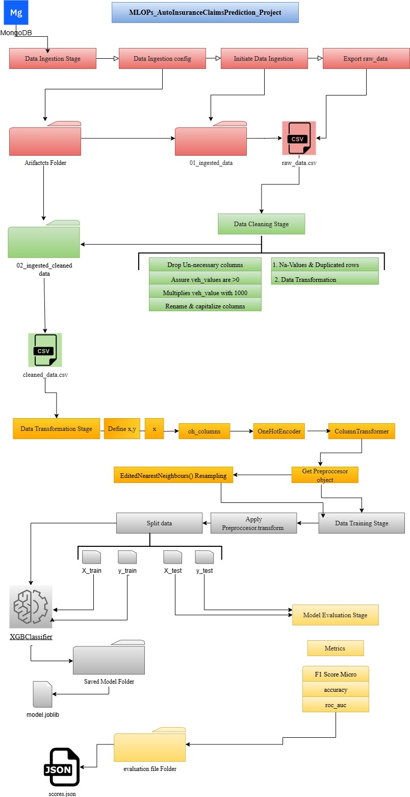

# MLOPs_AutoInsuranceClaimsPrediction_Project

## *Author  [Omar Soub](https://github.com/omars1234)*

## *Overview*

*On this Project ,we will create End to End MLOPS Project for House Prices Prediction Using Python Programming*


*to see the Project notebook please check :*  
[*AutoMobilePricesAnalysis-https://github.com/omars1234/Auto_Mobile_Inusrance_Analysis*](https://github.com/omars1234/Auto_Mobile_Inusrance_Analysis) 


## How to run ?

```bash
clone https://github.com/omars1234/EndToEndMachineLearningProjectAutoInsuranceClaimsPrediction.git
```

```bash
conda create -n EnvAuoInsuranceAnalysis python=3.10 -y
```

```bash
conda activate EnvAuoInsuranceAnalysis
```

```bash
pip install -r requirements.txt
```

## *WorkFlow*

*entity --> congfig --> components --> pipeleine --> run_pipeline*


* *add and run data ingestion part*  
* *add and run data cleaning part*  
* *add and run data transformation part*  
* *add and run data training part*  
* *add and run model evaluation part*   
## *create GitActions :(ci/cd)*

*to check if the run_pipeline.py file run perfectly*  

 --> python app.py  
* *add data prediction part*  


## *WorkFlow Visualization*





## *Feedback*

*If you have any feedback, please reach out to us at omars.soub@gmail.com*

## 🔗 Links

[*my github page-https://github.com/omars1234*](https://github.com/omars1234)

## *🛠 Skills*
*python, R, SQL ,PowerBi ,Tableaue*